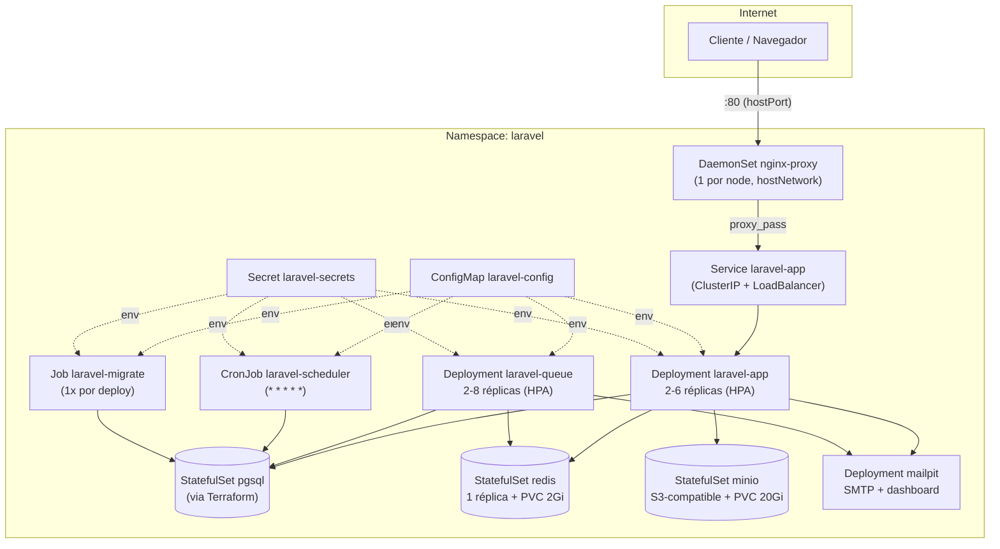
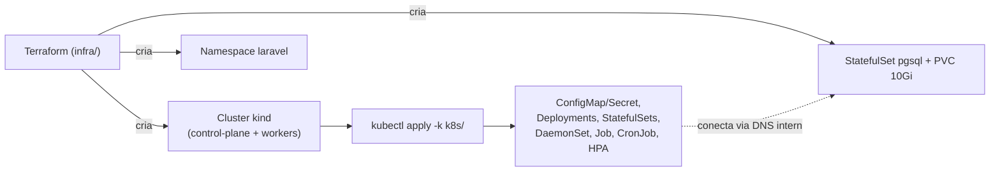
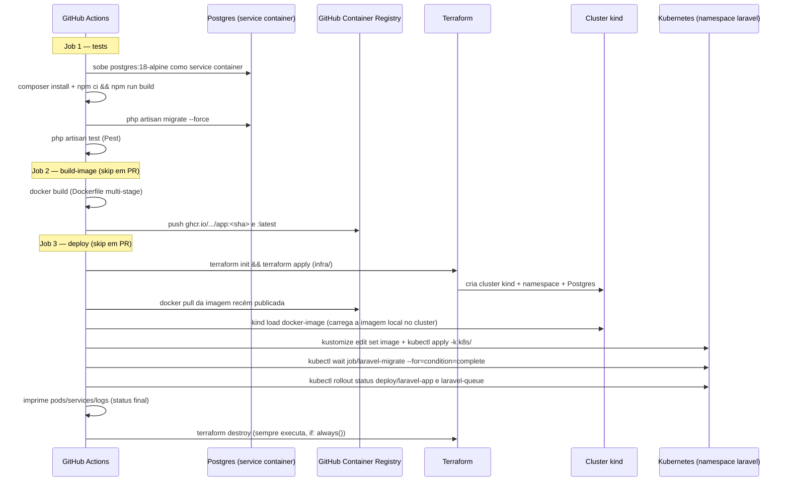

# Arquitetura Proposta — Deploy em Kubernetes

> Levantamento feito a partir do que já está implementado no repositório (`k8s/`, `infra/`, `Dockerfile`, `.github/workflows/ci-cd.yml`). Serve como base para o item "Desenho da arquitetura proposta" do desafio.

---

## 1. Componentes da aplicação

| Componente | Tipo de recurso | Réplicas | Responsabilidade |
|---|---|---|---|
| **laravel-app** | Deployment | 2 (HPA: 2–6) | Serve a API HTTP (`php artisan serve`, porta 80) |
| **laravel-queue** | Deployment | 2 (HPA: 2–8) | Worker de filas (`queue:work`) — processa e-mails (Mailpit/SMTP) e jobs assíncronos |
| **laravel-scheduler** | CronJob (`* * * * *`) | — | Roda `php artisan schedule:run` a cada minuto (equivalente ao cron do Laravel) |
| **laravel-migrate** | Job (batch, `backoffLimit: 3`) | — | Roda `php artisan migrate --force` uma vez por deploy |
| **nginx-proxy** | DaemonSet (`hostNetwork`, 1 por node) | N (= nº de nodes) | Reverse proxy de entrada, evita ponto único de falha; expõe porta 80 do host |
| **redis** | StatefulSet + PVC (2Gi) | 1 | Cache, sessão e broker de filas |
| **pgsql** | StatefulSet + PVC (10Gi) | 1 | Banco de dados principal (provisionado via Terraform, não via Kustomize) |
| **mailpit** | Deployment | 1 | Captura de e-mails em dev/staging (SMTP + dashboard) |
| **minio** | StatefulSet + PVC (20Gi) | 1 | Armazenamento de objetos compatível com S3 (`FILESYSTEM_DISK=s3`) |

Todos os componentes da aplicação (app, queue, scheduler, migrate) usam a **mesma imagem Docker**, diferenciando-se apenas pelo `command` executado. Toda a configuração é injetada via `ConfigMap laravel-config` + `Secret laravel-secrets` (`envFrom`), nunca hardcoded nos manifests.

---

## 2. Infraestrutura provisionada

A infraestrutura é dividida em duas camadas com responsabilidades bem separadas:

### 2.1 Terraform (`infra/`) — cluster + banco

| Recurso | O que provisiona |
|---|---|
| `kind_cluster.this` | Cluster Kubernetes local (**kind** — Kubernetes-in-Docker), 1 control-plane + N workers (`var.worker_count`, default 1), imagem `kindest/node:v1.31.2`. Porta 80 do control-plane mapeada para a porta do host (`var.host_http_port`, default 8080) |
| `kubernetes_namespace_v1.laravel` | Namespace `laravel` |
| `kubernetes_stateful_set_v1.pgsql` + PVC + Secret + ConfigMap | PostgreSQL (`postgres:18-alpine`), Service headless (`clusterIP: None`), DNS interno `pgsql.laravel.svc.cluster.local` |

Outputs: `kubeconfig_path`, `cluster_endpoint`, `database_host`, `app_url` (`http://localhost:<host_http_port>`).

> **Importante**: hoje é um cluster **local e efêmero** (kind), não uma cloud real. O `infra/README.md` já documenta o caminho de migração — trocar `cluster.tf`/`providers.tf` por `terraform-aws-modules/eks` + `aws_db_instance` (RDS), ou `google_container_cluster` + Cloud SQL — mantendo `database.tf`/`namespace.tf`/`k8s/` praticamente intactos.

### 2.2 Kubernetes (`k8s/`, aplicado via `kubectl apply -k k8s/`)

Orquestrado com **Kustomize** (`k8s/kustomization.yaml`), namespace único `laravel`:

- `config/configmap.yaml` + `config/secret.yaml` — configuração e segredos
- `redis/statefulset.yaml`, `mailpit/deployment.yaml`, `minio/statefulset.yaml` — serviços de apoio
- `app/migrate-job.yaml`, `app/deployment.yaml`, `app/service.yaml`, `app/queue-worker.yaml`, `app/scheduler.yaml`, `app/hpa.yaml` — a aplicação em si
- `nginx/daemonset.yaml` — proxy de entrada

Detalhes técnicos relevantes:
- **Probes**: liveness/readiness em `/up` (app), `redis-cli ping` (redis), `pg_isready` (pgsql), `/minio/health/live|ready` (minio), `queue:monitor` via exec (queue worker)
- **initContainer `wait-for-pgsql`** em `app`/`migrate`: bloqueia o start até o Postgres responder (`pg_isready` em loop)
- **HPA** (`autoscaling/v2`): `laravel-app` escala 2→6 réplicas por CPU 70%/memória 80%; `laravel-queue` escala 2→8 por CPU 75%; scale-down com estabilização de 300s (remove no máx. 1 pod/min), scale-up sem estabilização (até 2 pods/min)
- **Resources** (requests/limits) definidos em todos os containers — app: `250m/1000m` CPU, `256Mi/512Mi` memória; queue: `100m/500m`, `128Mi/256Mi`; redis/minio/mailpit com limites proporcionais menores

---

## 3. Fluxo de deploy

Pipeline único em `.github/workflows/ci-cd.yml`, disparado em `push`/`pull_request` para `master` (+ `workflow_dispatch` manual). Três jobs sequenciais, cada um dependendo do anterior (`build-image`/`deploy` só rodam fora de Pull Request):

Passo a passo resumido:

1. **`tests`** — sempre roda. Sobe Postgres como *service container*, instala dependências PHP/Node, builda os assets (Vite), roda migrations e a suíte Pest.
2. **`build-image`** — builda a imagem de produção (`Dockerfile` multi-stage: assets Vite → `php:8.4-cli-bookworm`) e publica no GHCR com duas tags (`:<sha>` e `:latest`).
3. **`deploy`** — provisiona a infraestrutura via Terraform (`infra/`: cluster kind + namespace + Postgres), carrega a imagem recém-buildada no cluster (`kind load docker-image`, já que é um registry local), aplica todos os manifests (`kubectl apply -k k8s/`), aguarda a `Job` de migration completar e o rollout dos `Deployments` da app/queue, imprime o status final e **destrói o cluster no final** (`terraform destroy`, mesmo em caso de falha) — cada execução do pipeline é uma validação ponta-a-ponta descartável, não um ambiente persistente.

---

## Observações / débitos técnicos identificados

- `k8s/README.md` está **desatualizado**: cita `nginx/deployment.yaml`, `redis/deployment.yaml` e `app/ingress.yaml`, mas os arquivos reais são `nginx/daemonset.yaml`, `redis/statefulset.yaml`, e não existe `ingress.yaml` no repositório.
- `k8s/pgsql/statefulset.yaml` existe fisicamente mas **não é referenciado** no `kustomization.yaml` — fica só como referência para quem quiser rodar sem Terraform.
- `APP_URL` no `ConfigMap` está com placeholder (`http://CHANGE-ME.exemplo.com`) — precisa ser ajustado para o domínio real antes de qualquer deploy que use os links assinados de aprovação/rejeição de orçamento por e-mail.
- Não há sincronização automática entre as variáveis de banco do Terraform (`infra/variables.tf`) e o `ConfigMap`/`Secret` do `k8s/` — hoje precisam bater manualmente.
- O ambiente é **local/efêmero** (kind) por execução de pipeline; não há um ambiente de produção persistente hoje — a evolução natural seria apontar `infra/` para EKS/GKE reais mantendo o restante do fluxo praticamente igual.
