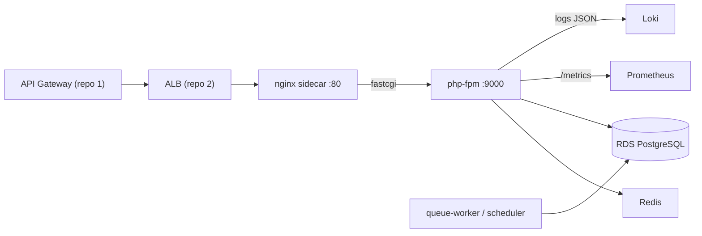

# oficina-api

Aplicação principal (Laravel 13) do **Tech Challenge Fase 3 — Oficina Mecânica**. É o **repositório 4 de 4**: a API REST do domínio (clientes, veículos, catálogo, estoque, ordens de serviço, relatórios), rodando em **Amazon EKS** atrás do **API Gateway** (repo 1) e do **ALB** (repo 2), usando o **RDS PostgreSQL** (repo 3).

| Repo | Papel |
|---|---|
| [oficina-k8s-infra](https://github.com/MicaelHernandes/oficina-k8s-infra) | VPC, EKS, ECR, ALB, DNS/TLS, monitoring, OIDC |
| [oficina-db-infra](https://github.com/MicaelHernandes/oficina-db-infra) | RDS PostgreSQL gerenciado |
| [oficina-auth-lambda](https://github.com/MicaelHernandes/oficina-auth-lambda) | Lambda de auth por CPF + API Gateway |
| **oficina-api** (este) | Aplicação Laravel no EKS |

## Tecnologias

- **PHP 8.4 / Laravel 13**, arquitetura **DDD** (bounded contexts em `src/`: Customer, Catalog, Inventory, Workshop, Reports).
- **PostgreSQL** (RDS), **Redis** (cache/fila/sessão), **Sanctum** (staff), **firebase/php-jwt** (JWT do gateway).
- **Swagger/OpenAPI** (l5-swagger), **Pest** (testes), **Pint** (estilo), **PHPStan/Larastan** (análise estática).
- **prometheus_client_php** (`/metrics`), **Monolog JSON** (logs correlacionados).
- **Docker** (php-fpm) + **nginx sidecar**, **Kustomize** (base + overlay `prod`), **HPA**.

## Arquitetura no cluster



Cada pod roda **php-fpm** (app) + **nginx** (sidecar, fastcgi). HPA por CPU/memória (2→6 réplicas). Ingress via **ALB compartilhado** (`app.codefive.com.br`).

## Documentação

- **ADRs** — [`docs/adr`](docs/adr): comunicação REST+JSON, HPA, observabilidade (Prometheus vs Datadog/New Relic), ambiente único.
- **RFCs** — [`docs/rfc`](docs/rfc): nuvem AWS, RDS PostgreSQL, autenticação CPF+JWT.
- **Diagramas** — [`docs/diagrams`](docs/diagrams): componentes, sequência (autenticação e abertura de OS), ER.
- **Swagger:** `GET /api/documentation` (l5-swagger) na aplicação publicada.

## Autenticação

A API tem **dois públicos**, com credenciais distintas no header `Authorization` — por isso cada rota exige um deles, nunca os dois.

| Público | Rotas | Autenticação | Caminho |
|---|---|---|---|
| **Cliente** | `/api/me/*` (dados, veículos e OS do próprio cliente) | JWT por **CPF**, emitido pela Lambda (repo 1) e revalidado pelo middleware `gateway.jwt` com a mesma `JWT_SECRET` | `api.codefive.com.br` (API Gateway + Lambda Authorizer) |
| **Staff** | demais rotas (clientes, veículos, catálogo, estoque, OS, relatórios) | token **Sanctum** de `/api/auth/login` | `app.codefive.com.br` (ALB) |

No portal do cliente o id vem do claim `sub` do token, nunca da URL, então um cliente não alcança dados de outro. Em produção o `GATEWAY_JWT_ENFORCE=true` liga a revalidação do JWT; em local/testes ele é passthrough. Ver [RFC-003](docs/rfc/RFC-003-auth-cpf-jwt.md).

## Observabilidade

- **`/metrics`** (Prometheus): latência por rota/status, OS por status, tempo médio de execução, falhas de integração. Coletado por `ServiceMonitor`.
- **Alertas** (`PrometheusRule`): falhas 5xx, latência p95 alta, deployment sem réplicas.
- **Dashboards** Grafana via ConfigMap (`grafana_dashboard: "1"`).
- **Logs JSON** no stdout com `X-Request-Id` (e `x-amzn-trace-id` do gateway) → Loki.

## Desenvolvimento local

```bash
composer install
cp .env.example .env && php artisan key:generate
# suba Postgres/Redis (compose.yaml) e rode:
php artisan migrate
php artisan test          # Pest
./vendor/bin/pint --test  # estilo
./vendor/bin/phpstan analyse --memory-limit=1G
```

## Deploy (automático)

- **`ci.yml`** (PR e push em `homolog`/`master`): Pint + PHPStan + Pest (com Postgres) + `docker build` sem push.
- **`deploy.yml`** (push em `master`, `environment: production`): build → push **ECR** (tag SHA + `latest`) → `aws eks update-kubeconfig` → cria o **Secret** a partir do Secrets Manager → `kubectl apply -k k8s/overlays/prod` → **Job de migrations** → `rollout status` → atualiza o **CNAME** `app.codefive.com.br` na Cloudflare.

**Secrets do repositório:** `AWS_ROLE_ARN` (role OIDC `oficina-gha-oficina-api`), `CLOUDFLARE_API_TOKEN`, `LARAVEL_APP_KEY` (chave `base64:...` estável do Laravel). Environment `production`.

## Dependência de ordem

Requer os repos **2 → 3 → 1** aplicados (lê ECR/cluster/DB/JWT via SSM e Secrets Manager). Ordem global de provisionamento: **2 → 3 → 1 → 4**.

## Custo

Roda sobre o EKS do repo 2 (sem custo adicional além de tráfego/armazenamento). **Destruir o ambiente após a apresentação.**
