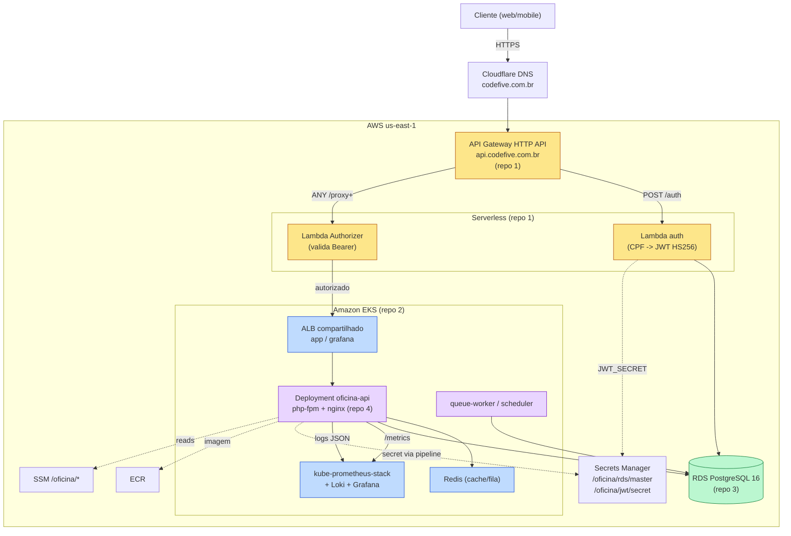

# Diagrama de componentes

Visão dos componentes da plataforma e suas dependências (4 repositórios).

**Legenda de responsabilidade:** amarelo = repo 1 (auth serverless), azul = repo 2 (k8s infra), verde = repo 3 (banco), roxo = repo 4 (aplicação).
