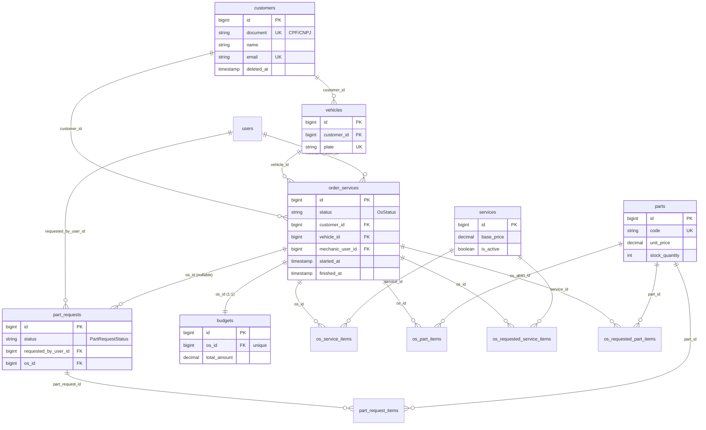

# Diagrama ER (modelo relacional)

Modelo persistido no PostgreSQL (tabelas de domínio; framework omitido). Fonte de verdade e detalhes em [oficina-db-infra/docs/er.md](https://github.com/MicaelHernandes/oficina-db-infra/tree/master/docs/er.md).

> `customers.document` = CPF/CNPJ (só dígitos); "inativo" = soft delete (`deleted_at`). `status` (OS, part_requests) são strings de enums PHP.

