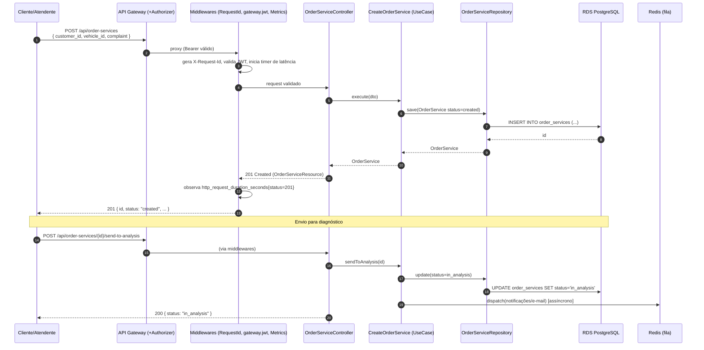

# Diagrama de sequência — Abertura de Ordem de Serviço (OS)

Fluxo de criação de uma OS e envio para diagnóstico, já autenticado via gateway.

O gauge `oficina_order_services{status}` (lido em `/metrics`) reflete o volume por status; o `PrometheusRule` alerta sobre falhas (5xx) no processamento.
