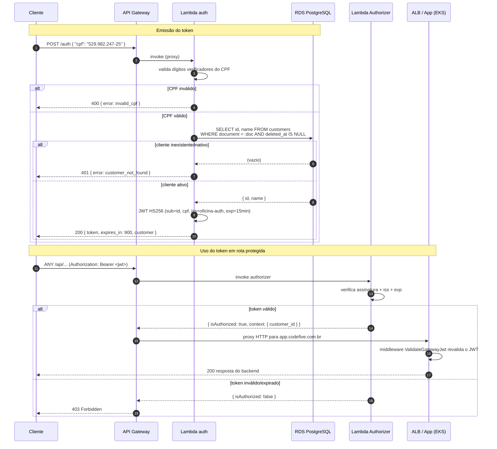

# Diagrama de sequência — Autenticação por CPF

```mermaid
sequenceDiagram
    autonumber
    participant C as Cliente
    participant GW as API Gateway
    participant A as Lambda auth
    participant DB as RDS PostgreSQL
    participant Z as Lambda Authorizer
    participant ALB as ALB / App (EKS)

    Note over C,DB: Emissão do token
    C->>GW: POST /auth { "cpf": "529.982.247-25" }
    GW->>A: invoke (proxy)
    A->>A: valida dígitos verificadores do CPF
    alt CPF inválido
        A-->>C: 400 { error: invalid_cpf }
    else CPF válido
        A->>DB: SELECT id, name FROM customers<br/>WHERE document = :doc AND deleted_at IS NULL
        alt cliente inexistente/inativo
            DB-->>A: (vazio)
            A-->>C: 401 { error: customer_not_found }
        else cliente ativo
            DB-->>A: { id, name }
            A->>A: JWT HS256 (sub=id, cpf, iss=oficina-auth, exp=15min)
            A-->>C: 200 { token, expires_in: 900, customer }
        end
    end

    Note over C,ALB: Uso do token em rota protegida
    C->>GW: ANY /api/... (Authorization: Bearer <jwt>)
    GW->>Z: invoke authorizer
    Z->>Z: verifica assinatura + iss + exp
    alt token válido
        Z-->>GW: { isAuthorized: true, context: { customer_id } }
        GW->>ALB: proxy HTTP para app.codefive.com.br
        ALB->>ALB: middleware ValidateGatewayJwt revalida o JWT
        ALB-->>C: 200 resposta do backend
    else token inválido/expirado
        Z-->>GW: { isAuthorized: false }
        GW-->>C: 403 Forbidden
    end
```
